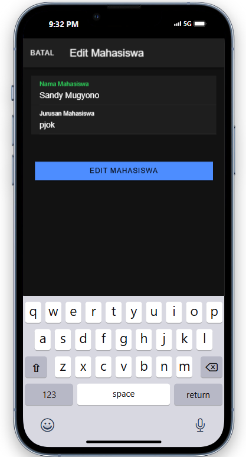

## 1. Create (Menambah Data)

Fungsi: Menambah data baru ke dalam sistem (misalnya menambahkan data mahasiswa).

Proses:

- Pengguna mengklik tombol Tambah Mahasiswa, yang memunculkan modal berisi formulir input.
- Pengguna memasukkan data (seperti nama dan jurusan mahasiswa) dan mengirimkannya.
- Setelah mengisi data, pengguna menekan tombol Tambah di dalam modal, yang kemudian memanggil fungsi tambahMahasiswa() di mahasiswa.page.ts.
- Fungsi tambahMahasiswa() melakukan validasi untuk memastikan data tidak kosong, lalu memanggil this.api.tambah() untuk mengirim data tersebut ke server menggunakan metode POST ke endpoint seperti tambah.php.
- Jika data berhasil disimpan di server, fungsi menutup modal, mereset input, dan memperbarui daftar mahasiswa dengan memanggil getMahasiswa().

		tambahMahasiswa() {
		  if (this.nama != '' && this.jurusan != '') {
		    let data = { nama: this.nama, jurusan: this.jurusan };
		    this.api.tambah(data, 'tambah.php').subscribe({
		      next: () => {
		        this.resetModal();
		        console.log('berhasil tambah mahasiswa');
		        this.getMahasiswa();  // Memperbarui data mahasiswa
		        this.modal.dismiss();  // Menutup modal
		      },
		      error: () => {
		        console.log('gagal tambah mahasiswa');
		      }
		    });
		  } else {
		    console.log('gagal tambah mahasiswa karena masih ada data yg kosong');
		  }
		}
		
## 2. Read (Membaca Data)

Fungsi: Menampilkan data yang ada di dalam sistem.

Proses:

- Ketika halaman MahasiswaPage diinisialisasi (dengan ngOnInit), fungsi getMahasiswa() dipanggil untuk mengambil data dari server.
- Fungsi getMahasiswa() mengirim permintaan GET ke server (misalnya, tampil.php) melalui this.api.tampil().
- Data yang diterima kemudian disimpan dalam variabel dataMahasiswa dan ditampilkan di template HTML menggunakan *ngFor.
- Hal ini memungkinkan pengguna untuk melihat daftar mahasiswa yang sudah ada.

		getMahasiswa() {
		  this.api.tampil('tampil.php').subscribe({
		    next: (res: any) => {
		      console.log('sukses', res);
		      this.dataMahasiswa = res;
		    },
		    error: (err: any) => {
		      console.log(err);
		    }
		  });
		}

## 3. Update (Memperbarui Data)

Fungsi: Mengubah data yang sudah ada di dalam sistem.

Proses:

- Dalam implementasi umum, pengguna mengklik item yang ingin diubah, yang memunculkan modal dengan data yang sudah ada.
- Pengguna bisa mengubah data di formulir dalam modal, lalu mengklik tombol Simpan.
- Fungsi updateMahasiswa() akan memanggil API update.php di backend, dengan data yang sudah diubah.
- Setelah pembaruan berhasil, modal akan ditutup dan daftar mahasiswa akan diperbarui dengan memanggil getMahasiswa() untuk menampilkan data terbaru.
- Contoh sederhana fungsi updateMahasiswa() (misalnya jika datanya berupa nama dan jurusan mahasiswa):

		updateMahasiswa() {
		  let data = { id: this.id, nama: this.nama, jurusan: this.jurusan };
		  this.api.update(data, 'update.php').subscribe({
		    next: () => {
		      this.resetModal();
		      console.log('berhasil update mahasiswa');
		      this.getMahasiswa();  // Memperbarui daftar mahasiswa
		      this.modal.dismiss();  // Menutup modal
		    },
		    error: () => {
		      console.log('gagal update mahasiswa');
		    }
		  });
		}

## 4. Delete (Menghapus Data)

Fungsi: Menghapus data dari sistem.

Proses:

- Di daftar mahasiswa, ada tombol "Hapus" yang memanggil fungsi confirmHapus(id) untuk meminta konfirmasi penghapusan dari pengguna.
- Jika pengguna mengonfirmasi penghapusan, fungsi hapusMahasiswa(id) dipanggil untuk mengirim permintaan DELETE ke backend (misalnya, ke hapus.php dengan ID mahasiswa sebagai parameter).
- Jika penghapusan berhasil, daftar mahasiswa akan diperbarui dengan memanggil getMahasiswa() untuk menghapus data yang sudah tidak ada.

		async confirmHapus(id: any) {
		  const alert = await this.alertController.create({
		    header: 'Konfirmasi Hapus',
		    message: 'Apakah Anda yakin ingin menghapus data ini?',
		    buttons: [
		      { text: 'Batal', role: 'cancel', handler: () => console.log('Penghapusan dibatalkan') },
		      { text: 'Ya', handler: () => this.hapusMahasiswa(id) }
		    ]
		  });
		  await alert.present();
		}

		hapusMahasiswa(id: any) {
		  this.api.hapus(id, 'hapus.php').subscribe({
		    next: () => {
		      console.log('Data berhasil dihapus');
		      this.getMahasiswa();  // Refresh data setelah penghapusan
		    },
		    error: (err: any) => {
		      console.log('Gagal menghapus data');
		    }
		  });
		}
